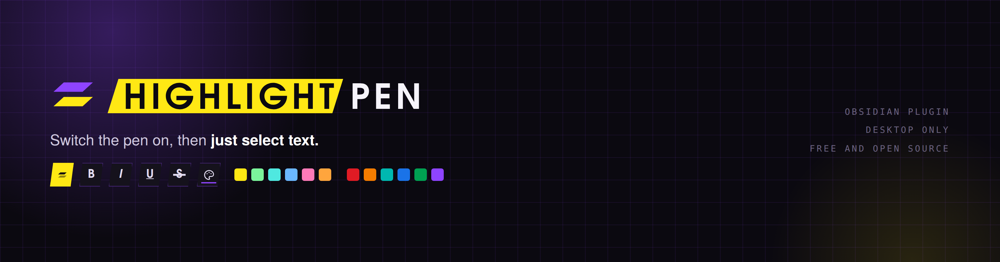
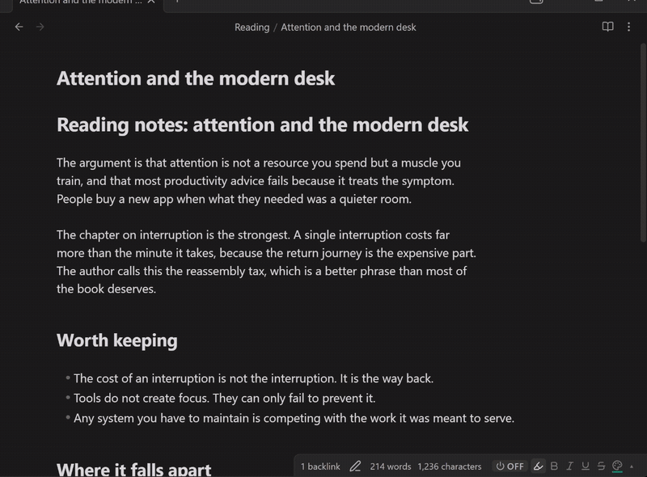
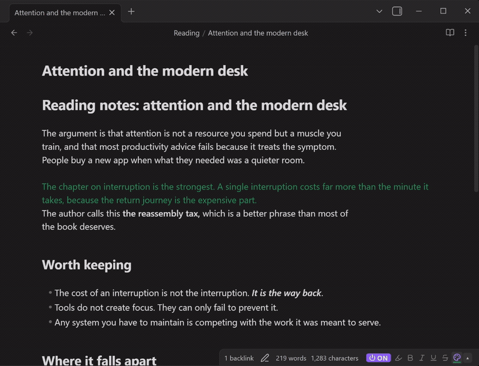
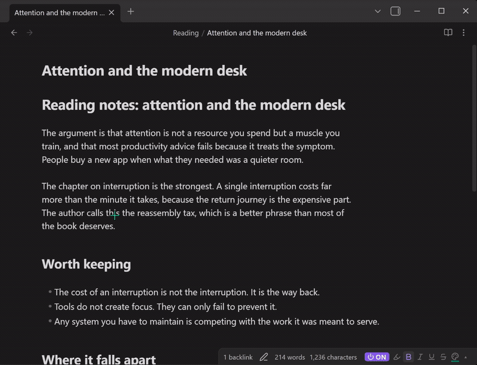
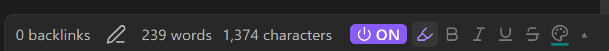
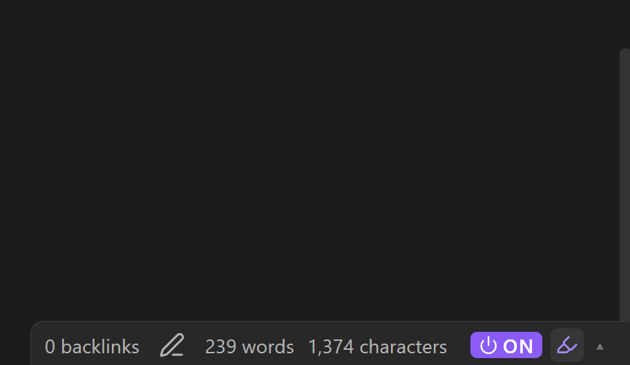
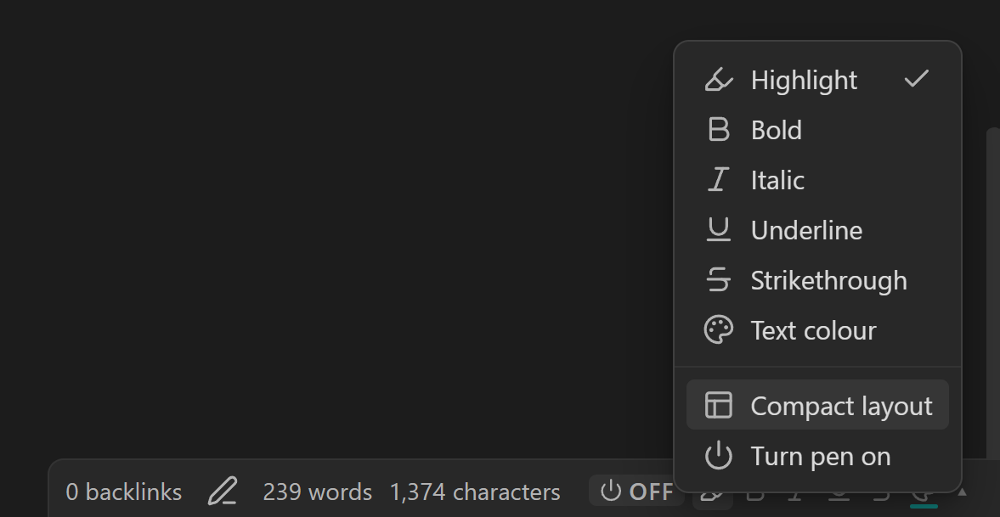
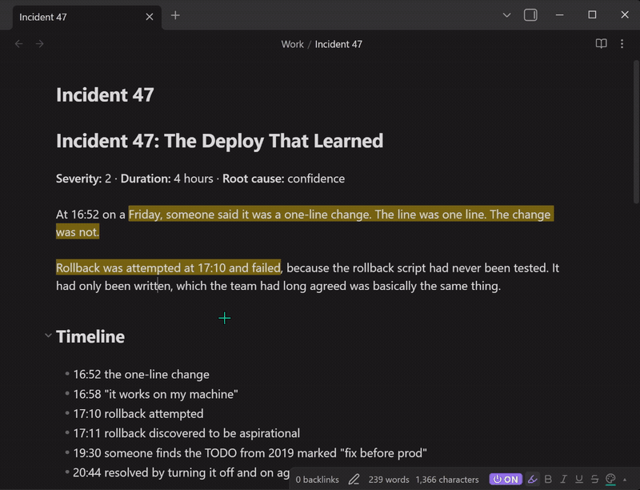

<p align="center">
  
</p>

<p align="center">
  
  
  
  
</p>

Switch the pen on, then just select text. It gets styled the moment you release the mouse. No menus, no hotkeys, no `==` typed by hand.

Select the same text again and the style comes off. Painting twice is undo.

<p align="center">
  <a href="https://github.com/user-attachments/assets/fd0950d9-7b5a-445f-a014-f2b36c4d95c8"></a>
</p>

<p align="center"><sub><b>Thirty seconds, start to finish.</b> 1080p, no sound. <a href="https://github.com/user-attachments/assets/fd0950d9-7b5a-445f-a014-f2b36c4d95c8">Play it here</a>.</sub></p>

## Why you might want it

Obsidian already has commands for bold, italic and highlight. They work one selection at a time, and each one costs a keystroke or a trip to a menu. If you're reading through a long note marking things up, that friction adds up.

Highlight Pen inverts it. Choose a style once, leave the pen on, and marking up a page becomes selection after selection, much closer to dragging a real highlighter down a printed page.

## Install

**From the community store.** Settings → Community plugins → Browse → search "Highlight Pen" → Install → Enable.

**Manually.** Download `main.js`, `manifest.json` and `styles.css` from the [latest release](../../releases/latest), put them in `<vault>/.obsidian/plugins/highlight-pen/`, then reload Obsidian and enable the plugin under Community plugins. Restricted mode must be off.

## Use it

1. Find the pen in the status bar, on the bottom right of the Obsidian window.
2. Click **OFF** so it reads **ON**. The cursor becomes a crosshair over the editor.
3. Select text.



That's the whole thing. The toolbar next to the switch holds the six styles:

| | Style | Writes |
| --- | --- | --- |
| 🖍 | Highlight | `==text==`, or `<mark>` with a colour |
| **B** | Bold | `**text**` |
| *I* | Italic | `*text*` or `_text_` |
| <u>U</u> | Underline | `<u>text</u>` |
| ~~S~~ | Strikethrough | `~~text~~` |
| 🎨 | Text colour | `<span style="color: …">` |

Click a style to switch to it. Click the colour icon to pick a colour. Six highlight colours and six text colours ship as defaults, and both palettes are yours to rename and edit.



Colour is a single style rather than one style per colour, so painting text that is already coloured takes the old colour off. Paint it again to put the new one on.

### Mixing styles

Click more than one style and they all apply at once. The nesting order is fixed, so the same set of styles always produces the same markup no matter which order you clicked them in.

Mixes of markdown styles stay markdown:

```markdown
~~***important***~~
```

Mixes that involve underline or text colour are written entirely as HTML:

```markdown
<span style="color: #e01b24;"><u><strong>important</strong></u></span>
```

That is deliberate. Obsidian will not combine markdown emphasis with inline HTML in either direction: `<u>**word**</u>` shows the asterisks literally, and `**<u>word</u>**` loses the bold. Writing the whole mix as HTML is the only spelling that renders correctly. A single style on its own is always plain markdown, so nothing changes unless you actually mix.

Painting the same mix again removes all of it, in either spelling. `Ctrl`/`⌘`+click a style to drop back to that one alone.



### Layouts

The status bar has two looks, switchable from the **▴** arrow.

**Toolbar**, all six styles on show:



**Compact**, only the styles currently active:



Right-click the pen, or use the arrow, for the full menu. Picking **Text colour** adds the palette to the same menu.



### Hotkeys worth setting

Settings → Hotkeys → search "Highlight Pen":

| Command | Suggestion |
| --- | --- |
| Toggle pen on/off | `Ctrl+Alt+P` |
| Next style | `Ctrl+Alt+N` |
| Open style picker | `Ctrl+Alt+K` |
| Set style: highlight / bold / … | one each, if you switch often |
| Add or remove style: … | for building a mix from the keyboard |
| Apply current style to selection | works with the pen **off**, for one-off use |

That last one matters. If always-on painting turns out not to suit you, leave the pen off and use Highlight Pen as an ordinary hotkey plugin.

## What it won't touch

The pen refuses to write into places where markers would break something:

- fenced and inline code
- inline and display math
- `[[wiki links]]`, and the `](url)` half of markdown links. The link *text* is still fair game
- YAML frontmatter

You get a brief notice when it declines. If your selection only partly covers something already formatted, the pen grows it out to the whole run rather than splitting the markers and leaving broken markdown behind.

Both behaviours are the **Protect code, math and links** setting, on by default.



## Highlight Pen settings

Open them at **Settings → Highlight Pen**, listed in the left sidebar under Community plugins.

| Setting | What it does |
| --- | --- |
| **Mix styles** | Let several styles apply at once. Off means clicking a style always replaces the current one. |
| **Protect code, math and links** | Skip protected regions, and snap partial selections out to whole runs. |
| **Highlight output** | `==text==` (portable, theme's yellow) or `<mark style="…">` (any colour, HTML). |
| **Italic marker** | `*` or `_`, for themes and linters that prefer underscores. |
| **Single stroke** | Pen switches itself off after one selection. |
| **Keyboard selections** | Also paint shift+arrow selections, applied when you release shift. |
| **Minimum characters** | Ignore short selections, so a stray double-click doesn't paint a word. Default 2. |
| **Status bar layout** | Toolbar shows every style; compact shows only the ones that are on. |
| **Status bar control** | Hide the pen from the status bar entirely. Needs a reload. |
| **Palettes** | Name and edit your own highlight and text colours, with a reset button. |

## A note on portability

Not everything the pen writes is standard markdown, and it's worth knowing which is which:

- `**bold**`, `*italic*` and `~~strikethrough~~` are CommonMark. They travel anywhere.
- Mixes involving underline or colour are HTML throughout (`<strong>`, `<em>`, `<s>`, `<mark>`, `<u>`, `<span>`), because markdown and inline HTML do not combine in Obsidian.
- `==highlight==` is an Obsidian and extended-markdown convention, not CommonMark. Some renderers show the `==` literally.
- Underline and text colour have no markdown equivalent at all, so they're written as `<u>` and `<span style="…">`. Obsidian renders them and they survive export to HTML, but not conversion to plain markdown.

If portability is what you care about, stay on markdown highlight output and the three standard styles.

## Compatibility

Desktop only. Obsidian's status bar doesn't exist on mobile, and the status bar is where this plugin lives.

Requires Obsidian 1.4.0 or newer. No build step, no dependencies. `main.js` is plain JavaScript you can read.

## Development

```bash
node test.js
```

71 assertions covering marker collisions, protected regions, selection snapping, style mixing and colour validation. No dependencies; it stubs the Obsidian API and drives the plugin against a fake editor.

To work against a live plugin, junction the repo into a scratch vault:

```powershell
cmd /c mklink /J "<vault>\.obsidian\plugins\highlight-pen" "<path to this repo>"
```

Don't do that inside a vault synced by Dropbox, Google Drive or similar. A junction is machine-local and sync clients handle them badly.

The identity lives in [`brand/`](brand), with the palette, the type and the usage rules in [`brand/brand.md`](brand/brand.md).

## Support

Bugs and requests: [open an issue](../../issues).

If it saves you time, you can [buy me a coffee](https://ko-fi.com/AlbyVitt). Entirely optional, and the plugin is free and always will be.

## Licence

The code is **MIT**. See [LICENSE](LICENSE). Fork it, ship it, sell it, put it in
something closed. Keep the copyright notice and we are square.

The **brand is not** covered by that. The mark, the wordmark and the name
"Highlight Pen" are reserved: see [brand/NOTICE.md](brand/NOTICE.md). Use them to
talk about this plugin as much as you like. Do not ship a fork under them. Rename
your fork and give it its own mark, and the code is yours to do as you please
with.
